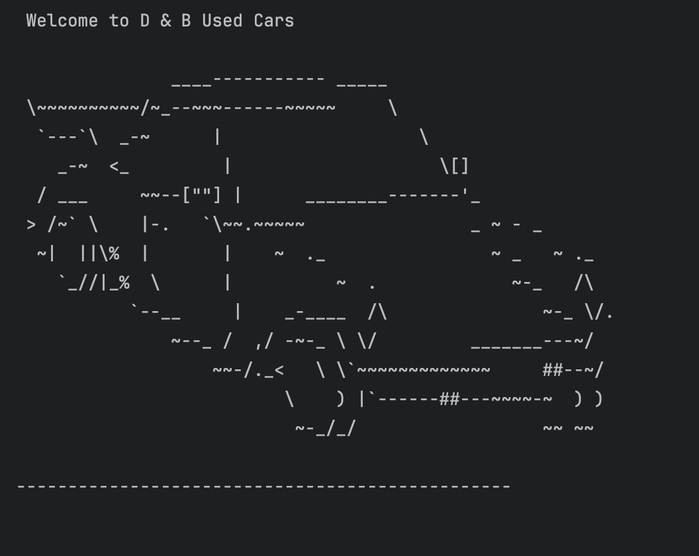

# Workshop Four Car Dealership


## Understanding the problem

- Inputs
    - User input

- Output
    - Command-Line Interface (CLI)
    - Creating an application that allows the user to view all vehicles, get the vehicles by price, make and model, year, color, mileage, and type. The user can also add and remove a vehicle.

## Making a plan

```// Pseudocode

// Using Scanner to take an initial user menu command

// First welcoming the user to D & B used car dealership,

// Second the user is prompted to the menu and to select from the options 

// Third the user is given an option to exit the program.

// After the prompt the user can select options 1-10 depending on what they are looking for 

// The application will print to the CLI the result of the user options
```

## Developers Favorite Piece Of Code
<details>
<summary>Click to expand  </summary> 

This is my favorite piece of code because I was able to align the data out in a table format and have everything print out more user-friendly.


I also enjoyed adding Ascii code to my project I thought the car piece of code would complement the project and make it more fun.



I also wanted to implement what we learned in class for unit testing and added some testing for the dealership file. I am happy that I did add it because I wanted to show importance to testing out the code and insuring accuracy. 


</details>


## SnapShots of the code working
<details>
<summary> Click to expand </summary>

### Home Screen


### Price 


### Make and Model 


### Year


### Color


### Mileage


#### Type


### Display all vehicles


### Add a new vehicle


### Remove a vehicle


### Exiting 


</details>


### Future Features
<details>
  <summary>Click to expand</summary>

- Checkout Menu
- Payment option
- Feedback 
- User Authentication
</details>
